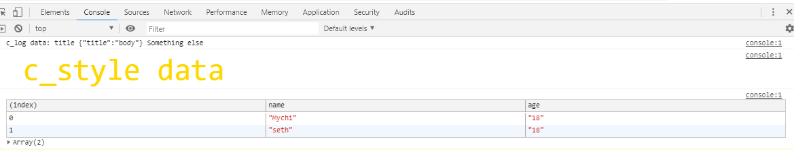

# Leaf JS Scripts <sup><span style="background: rgb(191, 200, 70); color: white; padding: 3px 7px; font-size: 12px;">BETA</span></sup>

This is a funny idea we just sort of made up during development. This whole `Scripts` functionality lets us use some JavaScript methods from our PHP apps without having to write nasty PHP strings with with variables....

To use these scripts, you simply have to call whichever method you need on the `Leaf\JS\Scripts` object, since all of it's methods are static

## Script Methods

### c_log

You might have guessed it😂. That's right, that's our `console.log`. It works exactly like how the javascript console.log works, so there's no need to speak much on this.

```php
Leaf\JS\Scripts::c_log("Text", ["message" => "Arrays are formatted into JSON"]);
```

### c_style

This one lets you style data you've logged to the console

```php
Leaf\JS\Scripts::c_style("Data, can be an array too", "css");
Leaf\JS\Scripts::c_style("c_style data", "color: gold; font-size: 50px;");
```

### c_table

Tabulate array data in console **(console.table)**

```php
\Leaf\JS\Scripts::c_table([["name" => "Mychi", "age" => "18"], ["name" => "seth", "age" => "18"]]);
```

### c_debug

**console.debug**.

```php
\Leaf\JS\Scripts::c_debug();
```

### c_clear

**console.clear**.

```php
\Leaf\JS\Scripts::c_clear();
```

### c_trace

**console.trace**.

```php
\Leaf\JS\Scripts::c_trace("trace message");
```



### localstorage_set

Our version of `localstorage.setItem` works the same way too. Arrays are made json by default.

```php
Leaf\JS\Scripts::localstorage_set("name", "Mychi Darko");
```

### localstorage_get

```php
$name = Leaf\JS\Scripts::localstorage_get("name");
```

### localstorage_remove

```php
Leaf\JS\Scripts::localstorage_remove("name");
```

### localstorage_clear

```php
Leaf\JS\Scripts::clear();
```

<hr>

### [Back to beta zone](2.1/beta-zone/)

<br>
Built with ❤ by <a href="https://mychi.netlify.app" style="font-size: 20px; color: #111;" target="_blank">Mychi Darko</a>